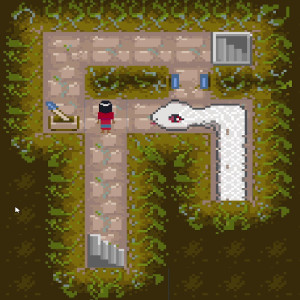
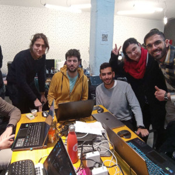

## 🐍 Welcome to Escape Amaru!

Embark on a thrilling puzzle adventure in **Escape Amaru**, a game where every step counts! Explore the depths of an ancient Inca temple dedicated to Amaru, the mythical serpent ruling the underworld. As your soul wanders through the underground, the Serpent God Amaru seeks to ensnare you. Maintain your cool, count every step, and navigate the perilous journey. Reach the final floor, devour the sacred Maca root awaiting you, and witness your soul's salvation. Uncover the myriad elements of roots – the Maca root, the subterranean temple, death, rebirth, and our earthly ties.

### Screenshots/Gallery




## Why Choose Escape Amaru?

This 2D puzzle masterpiece emerged during the "Turin Global Game Jam 2023" – a gathering of game devs crafting games in an intense three-day sprint. The 2023 theme, "Roots," inspired a captivating journey, enriched with optional modifiers like Latin ancestral history.

## Ready to Contribute?

Escape Amaru was born in a rush, riddled with bugs, lacking comments, and yearning for code structure refinement. Join us on this epic quest for improvement! Here's how:

1. **Create a Branch:**
   - Make a branch from "dev."
   - Add a prefix "bugfix_" or "feature_" based on your chosen task.

2. **Submit a Merge Request:**
   - Craft your enhancements or bug fixes.
   - Create a merge request and assign it to "salvolannister."

Gear up to shape the destiny of Escape Amaru! Your contribution could be the key to unleashing its full potential. 🚀🎮

## Explore More

## Utils
To add a Layer from the editor as you would do with a layerMask:
```csharp
[Layer]
int prova;
```
To implement a singleton, derive from the Manager<T> class.


### Trello Page 🚀
Keep up with our game development journey on [Trello](https://trello.com/invite/b/OARn4aKr/ATTI8184aeb3e87ef16beb69b01d568d772d7382DCCF/turingamejam). Get a glimpse of our tasks, progress, and upcoming features.

### Tutorials📹
Here some of the tutorial used to build the game:
-  [**How to change tiles at runtime in Unity (Burn your tilemap!)**](https://www.youtube.com/watch?v=hPsB6MiJPQY)!

### Meet the Team 🌟

- **Game Designers:** [Ahmed Omar](https://www.linkedin.com/in/ahmed-omar-8661a9193/)
- **Programmers:** Salvatore Gurzì (aka Salvolannister), [Simone Marca](https://www.linkedin.com/in/simone-marca-184a59100/), [Matteo Notarangelo](https://www.linkedin.com/in/mattnot/)
- **Audio Designer:** [Lorenzo Lingua](https://www.linkedin.com/in/lorenzo-lingua-68562b231/)
- **Artist:** [Pinna Elena](https://www.linkedin.com/in/elena-pinna-657638155/)

Dive into the brilliance and creativity that shapes Escape Amaru! 🎮✨


Certainly! To add images to your `readme.md` file on GitHub, you can use the following Markdown syntax. Assuming you have images in your repository or hosted online, replace the placeholder URLs with the actual paths or URLs of your images.


### Team Members/Images


